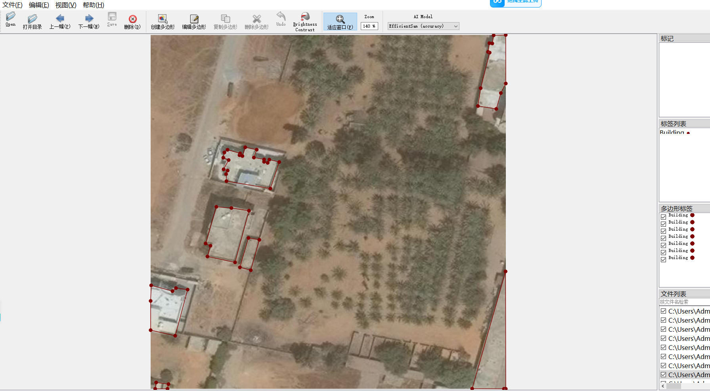
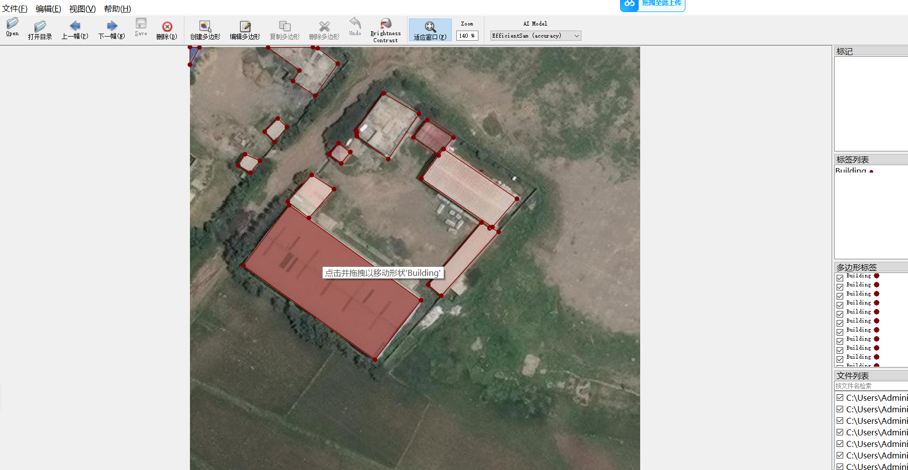
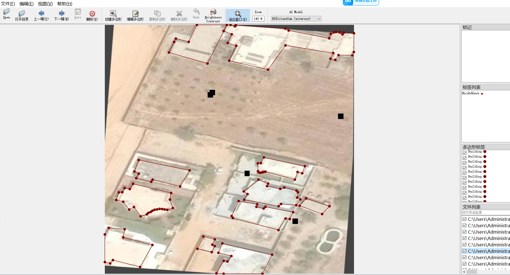

# Aerial Building Segmentation Dataset 14300 imagesjsonformat （(Augmented) ）

Aerial Building Segmentation Dataset (14300 images, JSON format, enhanced)

**Aerial Photo Segmentation Dataset (14,300 Images, JSON format, Enhanced) Introduction**

The dataset for aerial imagery of buildings is massive, comprising 14,300 clear resolution aerial images. It was expanded from the original data through data augmentation techniques such as rotation, flipping, color jitter, scale shifting, and affine transformations, significantly enhancing the diversity of the data and the generalization capability of the models. It is suitable for building instance segmentation and semantic segmentation tasks driven by deep learning.

The dataset covers a variety of geographical environments including cities, towns and many other types of buildings. The building forms are rich in diversity, including detached houses, row houses, high-rise buildings and irregular structures, which have high real complexity. All images are labeled by human beings with precise contours up to the pixel level.

The annotated information is stored in standard JSON format, with clear structure. Each JSON file corresponds to an image, containing the image path, size information and detailed annotations of multiple building instances. Each instance provides category labels (such as "building") and polygon contours composed of pixel coordinates for ease of generating training-required mask images. This format is widely compatible with labeling tools like LabelMe and CVAT, and mainstream frameworks such as PyTorch and TensorFlow.

This enhanced dataset effectively alleviates the issue of insufficient sample data for remote sensing images and is suitable for training models such as U-Net, Mask R-CNN, DeepLab, etc. It can be widely applied in fields such as urban monitoring, map production, disaster assessment, etc., and is a high-quality data resource for remote sensing and computer vision research.

## Images

---

Here is a pay link on Stripe (https://buy.stripe.com/3cs8yP7sY87d0vu9AB). Please contact me lonlonago@foxmail.com after funding $89, and I will send you a complete data files, thank you!

